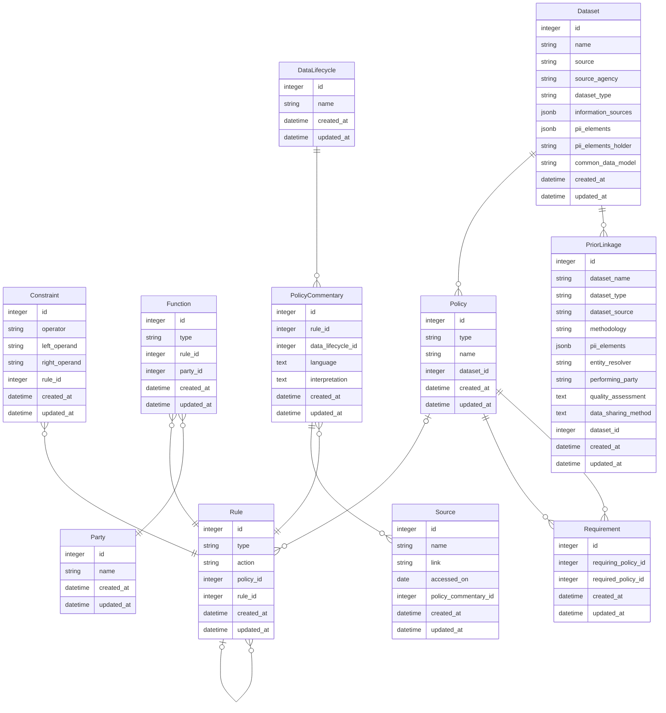

```mermaid
erDiagram
    %% --------------------------------------------------------
    %% Generated by "Rails Mermaid ERD"
    %% https://github.com/koedame/rails-mermaid_erd
    %% Restore Hash: #eyJzZWxlY3RNb2RlbHMiOlsiQ29uc3RyYWludCIsIkRhdGFMaWZlY3ljbGUiLCJEYXRhc2V0IiwiRnVuY3Rpb24iLCJQYXJ0eSIsIlBvbGljeSIsIlBvbGljeUNvbW1lbnRhcnkiLCJQcmlvckxpbmthZ2UiLCJSZXF1aXJlbWVudCIsIlJ1bGUiLCJTb3VyY2UiXSwiaXNQcmV2aWV3UmVsYXRpb25zIjpmYWxzZSwiaXNTaG93UmVsYXRpb25Db21tZW50IjpmYWxzZSwiaXNTaG93S2V5IjpmYWxzZSwiaXNTaG93Q29tbWVudCI6ZmFsc2UsImlzSGlkZUNvbHVtbnMiOmZhbHNlfQ==
    %% --------------------------------------------------------

    %%{init: {"themeCSS": ["[id*=Policy-] .er.entityBox { fill: orange; }; [id*=Rule-] .er.entityBox { fill: orange; }; [id*=Constraint-] .er.entityBox { fill: orange; };[id*=Party-] .er.entityBox { fill: orange; };"]}}%%

    %% table name: constraints
    Constraint {
        integer id  
        string operator  
        string left_operand  
        string right_operand  
        integer rule_id  
        datetime created_at  
        datetime updated_at  
    }

    %% table name: data_lifecycles
    DataLifecycle {
        integer id  
        string name  
        datetime created_at  
        datetime updated_at  
    }

    %% table name: datasets
    Dataset {
        integer id  
        string name  
        string source  
        string source_agency  
        string dataset_type  
        jsonb information_sources  
        jsonb pii_elements  
        string pii_elements_holder  
        string common_data_model  
        datetime created_at  
        datetime updated_at  
    }

    %% table name: functions
    Function {
        integer id  
        string type  
        integer rule_id  
        integer party_id  
        datetime created_at  
        datetime updated_at  
    }

    %% table name: parties
    Party {
        integer id  
        string name  
        datetime created_at  
        datetime updated_at  
    }

    %% table name: policies
    Policy {
        integer id  
        string type  
        string name  
        integer dataset_id  
        datetime created_at  
        datetime updated_at  
    }

    %% table name: policy_commentaries
    PolicyCommentary {
        integer id  
        integer rule_id  
        integer data_lifecycle_id  
        text language  
        text interpretation  
        datetime created_at  
        datetime updated_at  
    }

    %% table name: prior_linkages
    PriorLinkage {
        integer id  
        string dataset_name  
        string dataset_type  
        string dataset_source  
        string methodology  
        jsonb pii_elements  
        string entity_resolver  
        string performing_party  
        text quality_assessment  
        text data_sharing_method  
        integer dataset_id  
        datetime created_at  
        datetime updated_at  
    }

    %% table name: requirements
    Requirement {
        integer id  
        integer requiring_policy_id  
        integer required_policy_id  
        datetime created_at  
        datetime updated_at  
    }

    %% table name: rules
    Rule {
        integer id  
        string type  
        string action  
        integer policy_id  
        integer rule_id  
        datetime created_at  
        datetime updated_at  
    }

    %% table name: sources
    Source {
        integer id  
        string name  
        string link  
        date accessed_on  
        integer policy_commentary_id  
        datetime created_at  
        datetime updated_at  
    }

    Constraint }o--|| Rule : ""
    DataLifecycle ||--o{ PolicyCommentary : ""
    Dataset ||--o{ Policy : ""
    Dataset ||--o{ PriorLinkage : ""
    Function }o--|| Rule : ""
    Function }o--|| Party : ""
    Policy |o--o{ Rule : ""
    Policy ||--o{ Requirement : ""
    Policy ||--o{ Requirement : ""
    PolicyCommentary ||--o{ Source : ""
    PolicyCommentary }o--|| Rule : ""
    Rule |o--o{ Rule : ""
```
