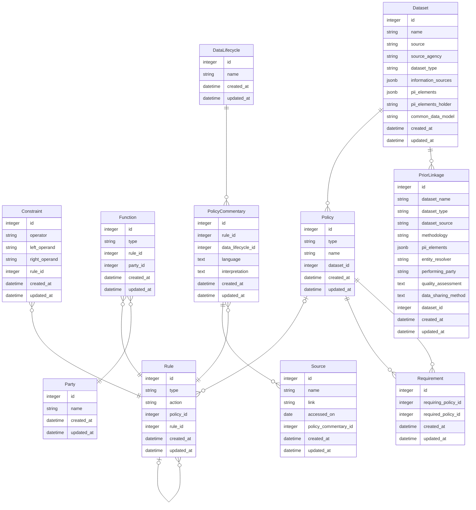

# Data Model

The Governance Metadata Database data model includes the data elements that represent descriptive
information and governance metadata describing datasets as well as the relationships between those
data elements.

# Data Dictionary

The current data model describes these data elements:

**Dataset** - represents a dataset for which governance metadata has been collected.
  * id - an identifier that uniquely identifies a dataset
  * name - the name of a dataset, e.g., National Survey on Drug Use and Health (NSDUH)
  * source - the source of a dataset, e.g., PCORnet
  * source_agency - the source agency of a dataset, if applicable, e.g., SAMHSA
  * dataset_type - the type of a dataset, e.g., Survey
  * information_sources - an array of information sources used to collect governance metadata about a dataset, e.g., Meeting with SAMHSA staff, Website
  * pii_elements - the personally identifiable information (PII) elements represented in a dataset, e.g., first name, last name
  * pii_elements_holder - the holder of the PII elements in a dataset, e.g., N3C data partners
  * common_data_model - the common data model used by a dataset, e.g., OMOP
  * created_at - a timestamp indicating when a dataset entry was created
  * updated_at - a timestamp indicating when a dataset entry was last updated

**PriorLinkage** - represents the prior linkages that have occurred for a dataset; each dataset can have zero or more prior linkages.
  * id - an identifier that uniquely identifies a prior linkage
  * dataset_name - the name of the dataset that was linked to, e.g., Centers for Medicare and Medicaid Services (CMS)
  * dataset_type - the type of the dataset that was linked to, e.g., administrative
  * dataset_source - the source of the dataset that was linked to, e.g., CMS
  * methodology - the methodology that was used for a data linkage, e.g., Non-PPRL method
  * pii_elements - an array of the PII elements that were used in a linkage, e.g., first name, middle initial, last name
  * entity_resolver - the entity resolver for a linkage, e.g., NCHS
  * performing_party - the party that performed a linkage, e.g., NCHS
  * quality_assessment - the quality assessment approach that was used for a linkage, e.g., Manual review
  * data_sharing_method - the method that was used for data sharing, e.g., Pre-linked data is made available through RDC
  * dataset_id - a reference to the dataset associated with a prior linkage entry
  * created_at - a timestamp indicating when a prior linkage entry was created
  * updated_at - a timestamp indicating when a prior linkage entry was last updated

**Policy** - Represents a governance metadata policy that applies to a dataset; each dataset can have zero or more policies.
  * id - an identifier that uniquely identifies a policy
  * type - the type of a policy, e.g., Agreement
  * name - the human readable name of a policy, e.g., NHANES Consent
  * dataset_id - a reference to the dataset associated with a policy entry
  * created_at - a timestamp indicating when a policy entry was created
  * updated_at - a timestamp indicating when a policy entry was last updated

The following policy types are present in the policy data loaded into the database:

| Term                      | Definition   |
| ------------------------- | ------------ |
| Agreement                 |A Policy that grants the assignee a Rule over an Asset from an assigner.|
| Certification             |An attestation that an official status has been earned by satisfying defined requirements, or the act of providing such a status, as proof that something has happened or defined standards have been met or will be upheld in the future.|
| Consent                   |The IRB-approved written record that is in compliance with the Common Rule (45 CFR 46) and as applicable, 21 CFR 50 Protection of Human Subjects rules, and is used to demonstrate the consent by a subject/Legally Authorized Representative to participate in research.|
| Contract                  |A contract is an agreement between parties, creating mutual obligations that are enforceable by law.|
| DataUseAgreement          |A document which establishes who is permitted to use and receive data, and the permitted uses and disclosures of such information by the recipient.|
| Determination             |Outcome of a legal decision or ruling. Includes a letter of determination that documents an IRB decision on the status of research. |
| IRBDocumentation          |Documents generated by or with an IRB including protocols, letters, and decisions. |
| Law                       |A system of rules created and enforced by governmental bodies that regulate the behavior of individuals, organizations, and governmental entities. Inclusive of statutes and regulations.|
| Policy                    |A non-empty group of Permissions and/or Prohibitions. A formal statement of intent or plan of action that is adopted by an organization such as a research entity and defines specific procedures, rules, or regulations that individuals  are expected to adhere to or follow.|
| PrivacyBoardDocumentation |Documents generated by or with a Privacy Board including protocols, letters, and decisions.|
| Process                   |A procedure that individuals are expected to adhere to or follow.|
| Request                   |A Policy that proposes a Rule over an Asset from an assignee.|

**Requirement** - Represents a relationship between two policies, where one policy can require another policy.
  * id - an identifier that uniquely identifies a requirement
  * requiring_policy_id - a reference to the policy that is requiring another policy
  * required_policy_id - a reference to the policy being required
 * created_at - a timestamp indicating when a requirement entry was created
 * updated_at - a timestamp indicating when a requirement entry was last updated

**Rule** - Represents a permission, prohibition, or a duty associated with a policy; each policy can have zero or more rules.
  * id - an identifier that uniquely identifies a rule
  * type - the type of a rule, e.g., Permission, Prohibition, or Duty
  * action - the action associated with a rule, which is typically an operation on the dataset, e.g., collect
  * policy_id - a reference to the policy associated with a rule entry
  * rule_id - a reference to a parent rule associated with a rule entry, used for duties that are associated with permissions
  * created_at - a timestamp indicating when a rule entry was created
  * updated_at - a timestamp indicating when a rule entry was last updated

The following actions are present in the rule data loaded into the database:

| Term              | Definition   |
| ----------------- | ------------ |
| access            |To acquire data from a data repository or other data sharing system.|
| anonymize         |To anonymize all or parts of the Asset.|
| approve           |To provide permission to perform the requested action in relation to the data.|
| classify          |To organize data by relevant categories so that it may be used and protected more efficiently.|
| collect           |Data collection is the process of gathering and measuring information on variables of interest, in an established systematic fashion that enables one to answer stated research questions, test hypotheses, and evaluate outcomes.|
| completeTraining  |To complete training.|
| deidentify        |To remove identifying information. De-identified patient data is patient information that has had personally identifiable information (PII; e.g. a person’s name, email address, or social security number), including protected health information (PHI; e.g. medical history, test results, and insurance information) removed. This is normally performed when sharing the data from a registry or clinical study to prevent a participant from being directly or indirectly identified.|
| execute           |To run the computer program Asset.|
| link              |To combine information from a variety of data sources for the same individual.|
| makeDetermination |To reach a decision or draw conclusions.|
| obtainApproval    |To obtain verifiable approval to perform the requested action in relation to the Asset.|
| obtainConsent     |To obtain verifiable consent to perform the requested action in relation to the Asset.|
| reidentify        |A general term for any process that re-establishes the relationship between identifying data and a data subject.|
| researchUse       |Working with data for scientific research or other analytical purposes.|
| reviewPolicy      |To review the Policy applicable to the Asset.|
| secondaryLink     |To link a dataset for a secondary purpose distinct from the original or primary intended purpose.|
| secondaryUse      |To use for a secondary purpose such as research or analysis.|
| sell              |To transfer the ownership of the Asset to a third party with compensation and while deleting the original asset.|
| share             |Making data available to the broader data user community, for example, by submitting the data to a data repository for dissemination.|
| sign              |Signing a document or agreement.|
| submit            |To submit a document such as a form, application, or protocol.|
| transfer          |To move the Asset from one digital location to another.|

**Constraint** - Represents a condition that is applicable to a rule; each rule can have zero or more constraints.
  * id - an identifier that uniquely identifies a constraint
  * left_operand - a value for comparison in a constraint, e.g., product
  * operator - the operator used to compare values in a constraint, e.g., eq
  * right_operand - a value for comparison in a constraint, e.g., LimitedDataSet
  * rule_id - a reference to the rule associated with a constraint entry
  * created_at - a timestamp indicating when a constraint entry was created
  * updated_at - a timestamp indicating when a constraint entry was last updated

The following left operands are present in the constraint data loaded into the database:

| Term                   | Definition   |
| ---------------------- | ------------ |
| careType               |Type of healthcare received by an individual.|
| recipient              |The party receiving the result/outcome of exercising the action of the Rule.|
| virtualLocation        |An identified location of the IT communication space which is relevant for exercising the action of the Rule.|
| product                |Category of product or service setting a context for exercising the action of the Rule.|
| purpose                |A defined purpose for exercising the action of the Rule.|
| accessPath             |A system that provides services, and the technical details of how to access a dataset.|
| consentRequirement     |A requirement to obtain consent from a person or organization.|
| dataRequester          |An individual or organization that requests access to a dataset that is not the participant.|
| deidentificationMethod |The method to remove the identifiers or any information that could directly identify an individual from a dataset to mitigate privacy risks to that participant.|
| linkageMethod          |The method used for linkage. Inclusive of PPRL and non-PPRL methods.|

The following right operands are present in the constraint data loaded into the database:

| Term                | Definition   |
| ------------------- | ------------ |
| AcademicResearch                  |Purposes associated with conducting or assisting with research conducted in an academic context e.g., within universities.|
| ApprovedProtocol                  |A protocol that has been submitted, reviewed, and approved by a designated group of people such as an institutional review board.|
| ApprovedPurpose                   |The allowed activity or purpose for which the operator wishes to use the asset.|
| ControlledAccess                  |Established processes for verifying appropriate use of shared data, such as requiring verification of requestor identity, committee approval of proposed research use, and signing a data use agreement to access protected data.|
| DataEnclave                       |A secure network through which confidential data, such as identifiable information from census data, can be stored and disseminated. In a virtual data enclave a researcher can access the data from their own computer but cannot download or remove it from the remote server. Higher security data can be accessed through a physical data enclave where a researcher is required to access the data from a monitored room where the data is stored on non-network computers.|
| DataProvider                      |Institutions, organizations, and researchers that collect data from patients or study participants or that collect administrative data and may also submit the data to a repository for sharing.|
| Deidentified                      |Having removed personally identifiable information (PII; e.g. a person’s name, email address, or social security number), including identifying protected health information (PHI; e.g., medical history, test results, and insurance information).|
| DeidentifiedDataset               |A set of information that has had personally identifiable information (PII; e.g. a person’s name, email address, or social security number), including identifying protected health information (PHI; e.g., medical history, test results, and insurance information) removed.|
| HIVHealthcare                     |Healthcare services related to the identification and treatment of human immunodeficiency virus.|
| LimitedDataset                    |A set of information about a participant that excludes 16 direct identifiers  and may be used or disclosed, for purposes of research, public health, or health care operations, without obtaining either an individual's Authorization or a waiver or an alteration of Authorization for its use and disclosure, with a data use agreement.|
| PrivacyPreservingRecordLinkage    |A method for linking dataset without sharing personally identifiable information|
| ReproductiveHealthcare            |Healthcare services related to human reproduction including family planning.|
| SafeHarborMethod                  |A method for deidentification by removal of protected health information.|
| Waived                            |When a designated body has refrained from applying or enforcing a requirement, standard, or rule.|

**Function** - Represents the function that a party has in relation to a rule; each rule can have zero or more functions, each with an associated party.
  * id - an identifier that uniquely identifies a function
  * type - the type of the function for the party, e.g., assignee
  * rule_id - a reference to the rule associated with a function entry
  * party_id - a reference to the party associated with a function entry
  * created_at - a timestamp indicating when a function entry was created
  * updated_at - a timestamp indicating when a function entry was last updated

The following function types are present in the function data loaded into the database:

| Term              | Definition   |
| ----------------- | ------------ |
| assigner          |The Party is the issuer of the Rule.|
| assignee          |The Party is the recipient of the Rule.|
| contracting_party |The Party who is offering the contract.|
| contracted_party  |The Party who is being contracted.|
| approving_party   |The Party providing approval on an asset.|
| approved_party    |The Party receiving approval on an asset.|
| consenting_party  |The Party to obtain consent from.|
| consented_party   |The Party who obtains the consent.|

**Party** - Represents an entity that has a role in a rule via a function; each rule can have zero or more parties, each through an associated function.
  * id - an identifier that uniquely identifies a party
  * name - the name of the party, e.g., DataRequester
  * created_at - a timestamp indicating when a party entry was created
  * updated_at - a timestamp indicating when a party entry was last updated

The following party names are present in the party data loaded into the database:

| Term                         | Definition   |
| ---------------------------- | ------------ |
| CertificationOrganization    |An organization that grants or approves certifications or certificates.|
| DataAccessCommittee          |A group of individuals who review all requests for access to datasets from external requestors and is composed of individuals with expertise in science, policy, or bioinformatics resources.|
| DataCoordinatingCenter       |Academic and commercial data management and study oversight organizations, including contract research organizations, whose responsibilities include providing some or all the following services: study administration, financial management, protocol administration, data management, stakeholder communication and coordination, quality assurance, site monitoring, safety, regulatory, document management, post-study management, and close-out activities.|
| DataEnclave                  |A secure network through which confidential data, such as identifiable information from census data, can be stored and disseminated. In a virtual data enclave a researcher can access the data from their own computer but cannot download or remove it from the remote server. Higher security data can be accessed through a physical data enclave where a researcher is required to access the data from a monitored room where the data is stored on non-network computers.|
| DataProvider                 |Institutions, organizations, and researchers that collect data from patients or study participants or that collect administrative data and may also submit the data to a repository for sharing.|
| DataRepository               |A physical location or virtual system where data is stored, managed, and organized for further use.|
| DataRequester                |An individual or organization that requests access to a dataset that is not the participant. |
| DisclosureReviewBody         |A group of individuals that establishes and operates processes and policies for the public release of data products that do not reveal any information about the individuals included in those datasets.|
| GovernmentOrganization       |An international, federal, state, tribal, or local government organization. Inclusive of departments or divisions within a larger government organization.|
| Guardian                     |An individual who is authorized under applicable State or local law to consent on behalf of a child to general medical care. Inclusive of a child’s biological or adoptive parent.|
| IRB                          |An Institutional Review Board (IRB) is the institutional entity charged with providing ethical and regulatory oversight of research involving human subjects, typically at the site of the research study.|
| LinkageHonestBroker          |An organization that holds deidentified tokens (“hashes”) and operates a service that matches tokens to link records.|
| MinorParticipant             |Refers to children or persons who have not attained the legal age for consent to treatments or procedures involved in the research, under the applicable law of the jurisdiction in which the research will be conducted.|
| Participant                  |A participant may be either a healthy human or a patient who is or becomes a participant in research, either being modified from receipt of the test article or as a control.|
| PrincipalInvestigator        |The investigator with the overall responsibility for the design, conduct, and reporting of the research, and must assure both the protocol and the research team’s actions are compliant with law, regulation, and NIH policy, even when certain aspects of the research are delegated to other investigators.|
| PrivacyBoard                 |A group of individuals who review and approve research uses and disclosures of data to ensure that the privacy rights of research participants are protected.|
| ReviewCommittee              |A group of individuals convened to review materials, provide approvals, and issue determinations on requested actions.|
| TechnologyVendor             |An organization providing technical services on behalf of another organization.|

**PolicyCommentary** - Represents human readable commentary on policies and rules, taken directly from the use case governance information Excel document; each rule can have zero or more policy commentaries.
  * id - an identifier that uniquely identifies a policy commentary
  * rule_id - a reference to the rule associated with a policy commentary entry
  * data_lifecycle_id - a reference to the data lifecycle associated with a policy commentary entry
  * language - language either providing an excerpt form a policy or commentary on a policy that is relevant to a rule
  * interpretation - an interpretation of the language as relevant to data collection, sharing, linkage, access, or use, e.g., Consent from adults authorizes data collection
  * created_at - a timestamp indicating when a policy commentary entry was created
  * updated_at - a timestamp indicating when a policy commentary entry was last updated

**Source** - Represents the sources of commentary on policies and rules; each policy commentary can have zero or more sources.
  * id - an identifier that uniquely identifies a source
  * name - the name of a source, if available, e.g., NCHS RDC Email Communication
  * link - the link to a source, if available, e.g., https://wwwn.cdc.gov/nchs/data/nhanes/2019-2020/documents/2019-Home-Interview-Consent-English-508.pdf
  * accessed_on - the date a source was accessed, if available, e.g., 2023-04-17
  * policy_commentary_id - a reference to the policy commentary associated with a source entry
  * created_at - a timestamp indicating when a source entry was created
  * updated_at - a timestamp indicating when a source entry was last updated

**DataLifecycle** - Represents the data lifecycle section of the use case governance information Excel document that commentary was taken from; each policy commentary has a data lifecycle.
  * id - an identifier that uniquely identifies a data lifecycle
  * name - the name of a data lifecycle, e.g., Data Linkage
  * created_at - a timestamp indicating when a data lifecycle entry was created
  * updated_at - a timestamp indicating when a data lifecycle entry was last updated

The following data lifecycle names are present in the data lifecycle data loaded into the database:

| Term            | Definition   |
| --------------- | ------------ |
| Data Collection |Obtaining data from participants for research, clinical, or administrative purposes. |
| Data Linkage    |Combining information from a variety of data sources for the same individual; synonymous with record linkage. |
| Data Sharing    |Making data available to the broader data user community, for example, by submitting the data to a data repository for dissemination. |
| Data Access     |Acquiring data from a data repository or other data sharing system. |
| Data Use        |Working with data for secondary research or other analytical purposes. |
