# Data Model

The Governance Metadata Database data model includes the data elements that represent descriptive
information and governance metadata describing datasets as well as the relationships between those
data elements.

```mermaid
erDiagram
    %% --------------------------------------------------------
    %% Generated by "Rails Mermaid ERD"
    %% https://github.com/koedame/rails-mermaid_erd
    %% Restore Hash: #eyJzZWxlY3RNb2RlbHMiOlsiQ29uc3RyYWludCIsIkRhdGFMaWZlY3ljbGUiLCJEYXRhc2V0IiwiRnVuY3Rpb24iLCJQYXJ0eSIsIlBvbGljeSIsIlBvbGljeUNvbW1lbnRhcnkiLCJQcmlvckxpbmthZ2UiLCJSZXF1aXJlbWVudCIsIlJ1bGUiLCJTb3VyY2UiXSwiaXNQcmV2aWV3UmVsYXRpb25zIjpmYWxzZSwiaXNTaG93UmVsYXRpb25Db21tZW50IjpmYWxzZSwiaXNTaG93S2V5IjpmYWxzZSwiaXNTaG93Q29tbWVudCI6ZmFsc2UsImlzSGlkZUNvbHVtbnMiOmZhbHNlfQ==
    %% --------------------------------------------------------

    %%{init: {"themeCSS": ["[id*=Policy-] .er.entityBox { fill: orange; }; [id*=Rule-] .er.entityBox { fill: orange; }; [id*=Constraint-] .er.entityBox { fill: orange; };[id*=Party-] .er.entityBox { fill: orange; };"]}}%%

    %% table name: constraints
    Constraint {
        integer id  
        string operator  
        string left_operand  
        string right_operand  
        integer rule_id  
        datetime created_at  
        datetime updated_at  
    }

    %% table name: data_lifecycles
    DataLifecycle {
        integer id  
        string name  
        datetime created_at  
        datetime updated_at  
    }

    %% table name: datasets
    Dataset {
        integer id  
        string name  
        string source  
        string source_agency  
        string dataset_type  
        jsonb information_sources  
        jsonb pii_elements  
        string pii_elements_holder  
        string common_data_model  
        datetime created_at  
        datetime updated_at  
    }

    %% table name: functions
    Function {
        integer id  
        string type  
        integer rule_id  
        integer party_id  
        datetime created_at  
        datetime updated_at  
    }

    %% table name: parties
    Party {
        integer id  
        string name  
        datetime created_at  
        datetime updated_at  
    }

    %% table name: policies
    Policy {
        integer id  
        string type  
        string name  
        integer dataset_id  
        datetime created_at  
        datetime updated_at  
    }

    %% table name: policy_commentaries
    PolicyCommentary {
        integer id  
        integer rule_id  
        integer data_lifecycle_id  
        text language  
        text interpretation  
        datetime created_at  
        datetime updated_at  
    }

    %% table name: prior_linkages
    PriorLinkage {
        integer id  
        string dataset_name  
        string dataset_type  
        string dataset_source  
        string methodology  
        jsonb pii_elements  
        string entity_resolver  
        string performing_party  
        text quality_assessment  
        text data_sharing_method  
        integer dataset_id  
        datetime created_at  
        datetime updated_at  
    }

    %% table name: requirements
    Requirement {
        integer id  
        integer requiring_policy_id  
        integer required_policy_id  
        datetime created_at  
        datetime updated_at  
    }

    %% table name: rules
    Rule {
        integer id  
        string type  
        string action  
        integer policy_id  
        integer rule_id  
        datetime created_at  
        datetime updated_at  
    }

    %% table name: sources
    Source {
        integer id  
        string name  
        string link  
        date accessed_on  
        integer policy_commentary_id  
        datetime created_at  
        datetime updated_at  
    }

    Constraint }o--|| Rule : ""
    DataLifecycle ||--o{ PolicyCommentary : ""
    Dataset ||--o{ Policy : ""
    Dataset ||--o{ PriorLinkage : ""
    Function }o--|| Rule : ""
    Function }o--|| Party : ""
    Policy |o--o{ Rule : ""
    Policy ||--o{ Requirement : ""
    Policy ||--o{ Requirement : ""
    PolicyCommentary ||--o{ Source : ""
    PolicyCommentary }o--|| Rule : ""
    Rule |o--o{ Rule : ""
```

# Data Dictionary

The current data model describes these data elements:

**Dataset** - represents a dataset for which governance metadata has been collected.
  * id - an identifier that uniquely identifies a dataset
  * name - the name of a dataset, e.g., National Survey on Drug Use and Health (NSDUH)
  * source - the source of a dataset, e.g., PCORnet
  * source_agency - the source agency of a dataset, if applicable, e.g., SAMHSA
  * dataset_type - the type of a dataset, e.g., Survey
  * information_sources - an array of information sources used to collect governance metadata about a dataset, e.g., Meeting with SAMHSA staff, Website
  * pii_elements - the personally identifiable information (PII) elements represented in a dataset, e.g., first name, last name
  * pii_elements_holder - the holder of the PII elements in a dataset, e.g., N3C data partners
  * common_data_model - the common data model used by a dataset, e.g., OMOP
  * created_at - a timestamp indicating when a dataset entry was created
  * updated_at - a timestamp indicating when a dataset entry was last updated

**PriorLinkage** - represents the prior linkages that have occurred for a dataset; each dataset can have zero or more prior linkages.
  * id - an identifier that uniquely identifies a prior linkage
  * dataset_name - the name of the dataset that was linked to, e.g., Centers for Medicare and Medicaid Services (CMS)
  * dataset_type - the type of the dataset that was linked to, e.g., administrative
  * dataset_source - the source of the dataset that was linked to, e.g., CMS
  * methodology - the methodology that was used for a data linkage, e.g., Non-PPRL method
  * pii_elements - an array of the PII elements that were used in a linkage, e.g., first name, middle initial, last name
  * entity_resolver - the entity resolver for a linkage, e.g., NCHS
  * performing_party - the party that performed a linkage, e.g., NCHS
  * quality_assessment - the quality assessment approach that was used for a linkage, e.g., Manual review
  * data_sharing_method - the method that was used for data sharing, e.g., Pre-linked data is made available through RDC
  * dataset_id - a reference to the dataset associated with a prior linkage entry
  * created_at - a timestamp indicating when a prior linkage entry was created
  * updated_at - a timestamp indicating when a prior linkage entry was last updated

**Policy** - Represents a governance metadata policy that applies to a dataset; each dataset can have zero or more policies.
  * id - an identifier that uniquely identifies a policy
  * type - the type of a policy, e.g., Agreement
  * name - the human readable name of a policy, e.g., NHANES Consent
  * dataset_id - a reference to the dataset associated with a policy entry
  * created_at - a timestamp indicating when a policy entry was created
  * updated_at - a timestamp indicating when a policy entry was last updated

**Requirement** - Represents a relationship between two policies, where one policy can require another policy.
  * id - an identifier that uniquely identifies a requirement
  * requiring_policy_id - a reference to the policy that is requiring another policy
  * required_policy_id - a reference to the policy being required
 * created_at - a timestamp indicating when a requirement entry was created
 * updated_at - a timestamp indicating when a requirement entry was last updated

**Rule** - Represents a permission, prohibition, or a duty associated with a policy; each policy can have zero or more rules.
  * id - an identifier that uniquely identifies a rule
  * type - the type of a rule, e.g., Permission, Prohibition, or Duty
  * action - the action associated with a rule, which is typically an operation on the dataset, e.g., collect
  * policy_id - a reference to the policy associated with a rule entry
  * rule_id - a reference to a parent rule associated with a rule entry, used for duties that are associated with permissions
  * created_at - a timestamp indicating when a rule entry was created
  * updated_at - a timestamp indicating when a rule entry was last updated

**Constraint** - Represents a condition that is applicable to a rule; each rule can have zero or more constraints.
  * id - an identifier that uniquely identifies a constraint
  * left_operand - a value for comparison in a constraint, e.g., product
  * operator - the operator used to compare values in a constraint, e.g., eq
  * right_operand - a value for comparison in a constraint, e.g., LimitedDataSet
  * rule_id - a reference to the rule associated with a constraint entry
  * created_at - a timestamp indicating when a constraint entry was created
  * updated_at - a timestamp indicating when a constraint entry was last updated

**Function** - Represents the function that a party has in relation to a rule; each rule can have zero or more functions, each with an associated party.
  * id - an identifier that uniquely identifies a function
  * type - the type of the function for the party, e.g., assignee
  * rule_id - a reference to the rule associated with a function entry
  * party_id - a reference to the party associated with a function entry
  * created_at - a timestamp indicating when a function entry was created
  * updated_at - a timestamp indicating when a function entry was last updated

**Party** - Represents an entity that has a role in a rule via a function; each rule can have zero or more parties, each through an associated function.
  * id - an identifier that uniquely identifies a party
  * name - the name of the party, e.g., DataRequester
  * created_at - a timestamp indicating when a party entry was created
  * updated_at - a timestamp indicating when a party entry was last updated

**PolicyCommentary** - Represents human readable commentary on policies and rules, taken directly from the use case governance information Excel document; each rule can have zero or more policy commentaries.
  * id - an identifier that uniquely identifies a policy commentary
  * rule_id - a reference to the rule associated with a policy commentary entry
  * data_lifecycle_id - a reference to the data lifecycle associated with a policy commentary entry
  * language - language either providing an excerpt form a policy or commentary on a policy that is relevant to a rule
  * interpretation - an interpretation of the language as relevant to data collection, sharing, linkage, access, or use, e.g., Consent from adults authorizes data collection
  * created_at - a timestamp indicating when a policy commentary entry was created
  * updated_at - a timestamp indicating when a policy commentary entry was last updated

**Source** - Represents the sources of commentary on policies and rules; each policy commentary can have zero or more sources.
  * id - an identifier that uniquely identifies a source
  * name - the name of a source, if available, e.g., NCHS RDC Email Communication
  * link - the link to a source, if available, e.g., https://wwwn.cdc.gov/nchs/data/nhanes/2019-2020/documents/2019-Home-Interview-Consent-English-508.pdf
  * accessed_on - the date a source was accessed, if available, e.g., 2023-04-17
  * policy_commentary_id - a reference to the policy commentary associated with a source entry
  * created_at - a timestamp indicating when a source entry was created
  * updated_at - a timestamp indicating when a source entry was last updated

**DataLifecycle** - Represents the data lifecycle section of the use case governance information Excel document that commentary was taken from; each policy commentary has a data lifecycle.
  * id - an identifier that uniquely identifies a data lifecycle
  * name - the name of a data lifecycle, e.g., Data Linkage
  * created_at - a timestamp indicating when a data lifecycle entry was created
  * updated_at - a timestamp indicating when a data lifecycle entry was last updated
