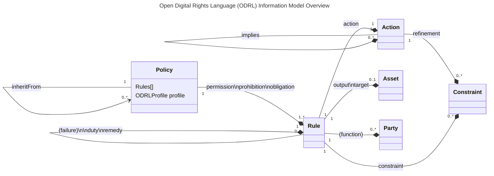
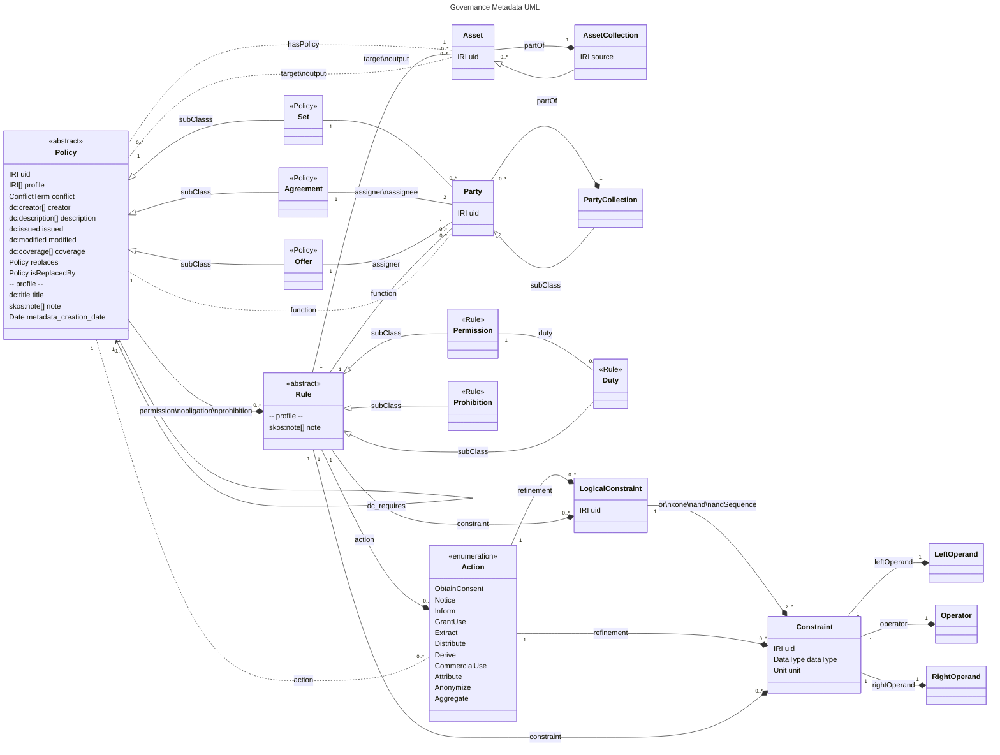
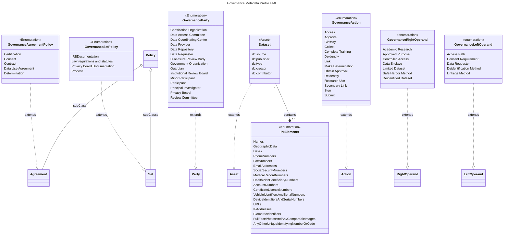
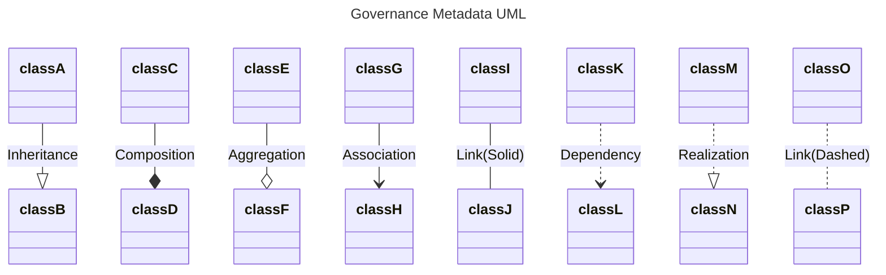

# Data Governance Metadata Schema User Guide 

**Table of Contents**

<!-- vscode-markdown-toc -->
  1. [Introduction](#Introduction)
  2. [Metadata Schema Resources](#MetadataSchemaResources)
  3. [Metadata Schema Description](#MetadataSchemaDescription)
  4. [Schema Diagram](#SchemaDiagram)
  5. [Schema Relationships](#SchemaRelationships)
  6. [Schema Components](#SchemaComponents)
	 * 6.1. [ODRL Classes](#ODRLClasses)
	 * 6.2. [Data Governance ODRL Profile](#DataGovernanceODRLProfile)
  7. [Schema Requirements](#SchemaRequirements)
	 * 7.1. [Must Support Requirements](#MustSupportRequirements)
	 * 7.2. [May Support Requirements](#MaySupportRequirements)
	 * 7.3. [Extensions](#Extensions)
	 * 7.4. [Enumerations](#Enumerations)
  8. [Metadata Schema Examples](#MetadataSchemaExamples)
	 * 8.1. [Example A: Data requesters must complete a Designated Agent Form and sign a Data Access Agreement to use DATASET_A](#ExampleA:DatarequestersmustcompleteaDesignatedAgentFormandsignaDataAccessAggreementtouseDATASET_A)
	 * 8.2. [Example B: Health Center IRB authorizes data linkage for DATASET_B; data requesters must obtain permission for linkage from Health Center IRB](#ExampleB:HealthCenterIRBauthorizesdatalinkageforDATASET_BdatarequestersmustobtainpermissionforlinkagefromHealthCenterIRB)
	 * 8.3. [Example C: Data Access Agreement authorizes data access and data use for DATASET_C](#ExampleC:DataAccessAgreementauthorizesdataaccessanddatauseforDATASET_C)
	 * 8.4. [Example D: Research network sites authorize linkage for DATASET_D on a study-by-study basis; data requestor must obtain permission to link datasets from each data contributing site.](#ExampleD:ResearchnetworksitesauthorizelinkageforDATASET_Donastudybystudybasisdatarequestormustobtainpermissiontolinkdatasetsfromeachdatacontributingsite.)
	 * 8.5. [Example E: Grant of Confidentiality from the U.S. Department of Justice prohibits re-identification of individuals in DATASET_E](#ExampleE:GrantofConfidentialityfromtheU.S.DepartmentofJusticeprohibitsreidentificationofindividualsinDATASET_E)
	 * 8.6. [Example F: Assent from child authorizes sharing DATASET_F](#ExampleF:AssentfromchildauthorizessharingDATASET_F)
  9. [Management of Implementation Over Time](#ManagementofImplementationOverTime)
	 * 9.1. [Contact information](#Contactinformation)
	 * 9.2. [Contributors and Funding](#ContributorsandFunding)
	 * 9.3. [References and Further Reading](#ReferencesandFurtherReading)
  10. [License](#License)

<!-- vscode-markdown-toc-config
	numbering=true
	autoSave=false
	/vscode-markdown-toc-config -->
<!-- /vscode-markdown-toc -->

##  1. <a name='Introduction'></a>Introduction
This user guide introduces a metadata schema for annotating data governance information to inform decisions about linking individual-level participant data and sharing and using linked datasets. A metadata schema, as defined in this guide, is a structured set of metadata elements and attributes, together with their associated semantics, that are designed to support a specific set of user tasks and types of resources in a particular domain. “Governance” or “data governance” as defined in this guide, comprises the policies, limitations, processes, and controls that address ethics, privacy protections, compliance, risk management, or other requirements for a given data linkage implementation across the data lifecycle.

The _Eunice Kennedy Shriver_ National Institute of Child Health and Human Development (NICHD) Office of Data Science and Sharing (ODSS) engaged the Health federally funded research and development center (Health FFRDC), operated by The MITRE Corporation, to develop a robust metadata schema for data governance information relevant to linking individual-level participant data and sharing and using linked datasets. 

Structured annotation of governance information enables meaningful sharing of governance metadata alongside datasets to promote appropriate linkage, sharing, and reuse. In this schema, governance information is captured at the dataset level and includes basic dataset information, history of linkage, availability of linkage-required attributes, sources of governance information (e.g., data use agreements, consents, laws, and institutional review board (IRB) determinations), policies and rules within those sources (e.g.,permissions to link dataset, prohibitions on dataset use), constraints that enforce those rules (e.g., dataset accessible only in a protected enclave, specified methods for dataset de-identification), and the parties that those policies, rules, and constraints apply to. It is important to note that de-identification is not synonymous with anonymization; de-identification meaning the removal or hiding of explicit individual identifiers, whereas anonymization connotes that, if attempted, patient data is not able to be linked to identify a given individual. 

While the primary intended users of the metadata schema are developers, the ultimate goal of implementing the schema is to streamline data provider, data steward, and researcher decisions regarding whether two or more datasets can be linked and how linked data can be shared and used. For developers, the metadata schema may be implemented to annotate unstructured governance information with structured metadata, readying that metadata for exchange.  However, data providers, data stewards, and researchers can also use the schema as a framework to standardize and organize governance information. For data providers, the schema can be used to define a minimum or ideal set of governance information that is required to convey whether or not a dataset can be linked. For researchers interested in linking datasets, the schema illustrates what governance information and metadata are needed to determine whether linkage is possible, and if so, what rules are inherited by the linked dataset. 

More information is available on the [project](https://github.com/NIH-NICHD/Data-Linkage-Governance ) that supported schema development and two proof-of-concept projects to test the schema. 

##  2. <a name='MetadataSchemaResources'></a>Metadata Schema Resources
These resources have been developed to support data providers, data stewards, researchers, and developers in metadata schema adoption and use:

- [A description and definition of metadata schema components](#MetadataSchemaDescription)
- [A metadata schema Unified Modeling Language diagram](#SchemaDiagram)
- [A data dictionary of the data governance profile (a governance-specific subset of the metadata schema)](#DataGovernanceProfile)
- [A description of schema requirements](#SchemaRequirements)
- [Six examples of common data governance concepts encoded within the metadata schema](#ExampleA:DatarequestersmustcompleteaDesignatedAgentFormandsignaDataAccessAggreementtouseDATASET_A)

##  3. <a name='MetadataSchemaDescription'></a>Metadata Schema Description
The metadata schema is a structured framework that outlines technical rules and conventions to create, provide, maintain, and use data governance metadata. 
This schema was developed based on a comprehensive [landscape analysis](../LandscapeAnalysis.md) of existing governance-relevant standards, including ontologies, terminologies, vocabularies, schemas, and common data models. This analysis identified [Open Digital Rights Language (ODRL) information model](https://www.w3.org/TR/odrl-model/) as the information model and basis for the schema design.



The Open Digital Rights Language (ODRL) is a versatile policy articulation language that offers an adaptable and interoperable data model, vocabulary, and encoding systems for expressing statements about the utilization of content and services. The foundational elements for the semantics of the ODRL policies are outlined in the ODRL Information Model, which details the core concepts, entities, and relationships. _Policies_ are made up of _rules_ which are employed to denote permitted (allowed) and prohibited (forbidden) _actions_ on a specific _asset_, as well as the responsibilities that stakeholders are required to fulfill (i.e., obligations). Furthermore, _rules_ can be subject to _constraints_ (e.g., locations of data access) and duties (such as obtaining approvals) that can be imposed on permissions. This system of rules and constraints serves as an ideal basis for governance metadata schema development, and a useful representation of relevant policies, rules, parties, and constraints. Further information on ODRL can be found [here](https://www.w3.org/TR/odrl-model/). 

This user guide focuses on the unique aspects of a data governance-specific vocabulary that the project team has used to extend the ODRL Core Vocabulary with new terms to express policies in the data governance space ([Data Governance Profile](#DataGovernanceProfile)). This schema reflects ODRL structure with selected additions for data governance concepts, derived from auxiliary standards, denoted in a data governance profile. The data governance profile incorporates some concepts from the Data Privacy Vocabulary ([DPV] - https://w3c.github.io/dpv/dpv/), the Dublin Core terms ([DC] - https://www.dublincore.org/specifications/dublin-core/dcmi-terms/), as well as Simple Knowledge Organization System ([SKOS] - https://www.w3.org/TR/skos-reference/).

##  4. <a name='SchemaDiagram'></a>Schema Diagram
The schema Unified Modeling Language (UML) diagram provides a visual representation of the schema's structure and relationships.





##  5. <a name='SchemaRelationships'></a>Schema Relationships



The diagram above is used to illustrate the different types of relationships between classes in the UML diagram. Not all types of UML relationships are used in this version of the schema. Please note that these are general UML concepts and their specific interpretation can vary based on the context of the diagram.

1.	**Inheritance (--|>):** Represents a relationship between two classes where one class (the subclass) inherits from another class (the superclass). In the legend, classA is a subclass of classB.
2.	**Composition (--*):** Represents a type of association that represents a part-whole or part-of relationship. In the legend, classC is composed of classD
3.	**Aggregation (--o):** Represents a variant of the "has a" association relationship; aggregation is more specific. It's a relationship between two classes that is best described as a "has-a" and "whole/part" relationship. In the legend, classE is aggregated with classF.
4.	**Association (-->):** Represents a relationship between two classes that allows one object instance to cause another to perform an action on its behalf. In the legend, classG is associated with classH.
5.	**Link (Solid) (--):** Represents a simple relationship between two classes. In the legend, classI is linked to classJ.
6.	**Dependency (..>):** Represents a relationship in which one class depends on another. If the class being depended on changes, the dependent class may be affected. In the legend, classK is dependent on classL.
7.	**Realization (..|>):** Represents a relationship between two classes, where one class implements the behavior specified by another. In the legend, classM realizes classN.
8. **Link (Dashed) (..):** Represents a weaker form of relationship between two classes. In the legend, classO is weakly linked to classP. 

##  6. <a name='SchemaComponents'></a>Schema Components 
The data governance metadata schema is primarily an ODRL structure, with modest extensions to capture data governance-specific concepts. Section 6.1 provides an overview of how ODRL can be used to annotate governance metadata and section 6.2 defines the Data Governance Profile. 

###  6.1. <a name='ODRLClasses'></a>ODRL Classes
[Link to ODRL Documentation](https://www.w3.org/TR/odrl-model/#policy) 
|   | ODRL Class | ODRL Definition and Data Governance Examples|
| -------- | ---------- | ---------- |
| Assets: | Asset | Represents an asset with a unique identifier. Datasets for which governance metadata is recorded are represented as assets.|
|  | AssetCollection | Represents a collection of assets with a source. |
| Policies: | Policy | A group of one or more rules. Represents an abstract policy class with properties like uid, profile, conflict, creator, description, issued, modified, coverage, replaces, and isReplacedBy. Common governance policies include laws and regulations, data use agreements, consents, IRB documents, and standalone policies unaffiliated with formal documentation. |
|  | Set | Represents a default policy with any combination of rules. Laws and regulations without an assigned party can be represented as a set.|
|  | Offer | Represents an offer policy that is being granted from an assigner but does not grant any rules.|
|  | Agreement | Represents an agreement policy. As agreements require an assignee and assigner, data use agreements, consents, and IRB determinations are common types of governance-relevant agreements. |
| Parties: | Party | Represents a party with a unique identifier. A party may be an individual such as a study participant or the principal investigator, an organization, or an entity within an organization such as an IRB or a Data Steering Committee.|
|  | PartyCollection | Represents a collection of parties. |
| Rules: | Rule | Represents an abstract rule class. Rules may be permissions, prohibitions, or obligations. Rules are nested within a policy. A given policy might have none, one, or multiple rules.|
|  | Permission | Represents a permission rule. Relevant governance permissions can be permission to link or permission to use a dataset.|
|  | Prohibition | Represents a prohibition rule. Relevant governance prohibitions can be prohibition to re-identify a dataset. |
|  | Obligation | Represents an obligation rule. Relevant governance obligation can be an obligation to obtain approval to link.|
| Actions: | Action | Represents different types of actions. Actions are tied to rules and constraints. ODRL contains many action terms such as obtainConsent, inform, grantUse, extract, distribute, derive, commercialUse, attribute, anonymize, or aggregate. Governance specific terms such as collect, link, and re-identify were added through the data governance profile. |
| Constraints: | Constraint | Represents a constraint with properties like uid, dataType, and unit. Constraints are limitations or caveats to a rule and are represented with a left and right operand and an operator. For example, a permission to access a dataset only within a secure enclave.|
|  | LogicalConstraint | Represents a logical constraint, which is used for expressions that compare two or more existing constraints. If the comparison of contraints based on a logical operator like _and_ or _or_ returns a logical match, then the Logical Constraint is satisfied, otherwise it is not satisfied.|
|  | LeftOperand | This class represents the left operand in a constraint. In a constraint expression, the left operand is the value or property that the constraint is applied to. |
|  | Operator | This class represents the operator in a constraint. The operator determines how the left operand is compared to the right operand. Common operators include equals, less than, greater than, and not equals. |
|  | RightOperand | This class represents the right operand in a constraint. In a constraint expression, the right operand is the value that the left operand is compared to. The relationships between these classes represent how they work together to define a constraint. For example, a Constraint has a LeftOperand, an Operator, and a RightOperand. This could represent a constraint like "virtualLocation eq ControlledAccess," where "virtualLocation" is the LeftOperand, "Equals" is the Operator, and "ControlledAccess" is the RightOperand. Notably, the RightOperand can hold a single value or a list. |

**Duty**

Duty, as defined in the context of the ODRL Information Model, is the obligation to perform an action. It is a key component of a Rule and is disjoint from Permission and Prohibition. A Duty is associated with a consequence property and is in the range of duty, obligation, consequence, and remedy. 

There are specific types of Duties such as Obligation, which relates an individual Duty to a Policy. Another type is Consequence, which relates a Duty to another Duty, the latter being a consequence of not fulfilling the former. Lastly, Remedy relates an individual remedy Duty to a Prohibition. 

| | Duty | Obligation | Has Duty | Consequence | Remedy |
| --- | --- | --- | --- | --- | --- |
| **Definition** | The obligation to perform an Action | Relates an individual Duty to a Policy. | Relates an individual Duty to a Permission. | Relates a Duty to another Duty, the latter being a consequence of not fulfilling the former. | Relates an individual remedy Duty to a Prohibition. |
| **Label** | Duty | Obligation | Has Duty | Consequence | Remedy |
| **Identifier** | [http://www.w3.org/ns/odrl/2/Duty](http://www.w3.org/ns/odrl/2/Duty) | [http://www.w3.org/ns/odrl/2/obligation](http://www.w3.org/ns/odrl/2/obligation) | [http://www.w3.org/ns/odrl/2/duty](http://www.w3.org/ns/odrl/2/duty) | [http://www.w3.org/ns/odrl/2/consequence](http://www.w3.org/ns/odrl/2/consequence) | [http://www.w3.org/ns/odrl/2/remedy](http://www.w3.org/ns/odrl/2/remedy) |
| **Note** | - | The Duty is a requirement which must be fulfilled. | A Duty is a pre-condition which must be fulfilled in order to receive the Permission. | The consequence property is utilised to express the repercussions of not fulfilling an agreed Policy obligation or duty for a Permission. If either of these fails to be fulfilled, then this will result in the consequence Duty also becoming a new requirement, meaning that the original obligation or duty, as well as the consequence Duty must all be fulfilled | The remedy property expresses an agreed Duty that must be fulfilled in case that a Prohibition has been violated by being exercised. |
| **Parent property** | - | - | - | failure | failure |
| **Domain** | - | Policy | Permission | Duty | Prohibition |
| **Range** | - | Duty | Duty | Duty | Duty |


###  6.2. <a name='DataGovernanceODRLProfile'></a>Data Governance ODRL Profile
The Data Governance Profile represents the extension to ODRL required to accurately represent governance metadata. The ODRL profile includes classes that represent different aspects of data governance, such as policies, parties involved, datasets, actions, rights, and personally identifiable information (PII) elements. 

For those interested in using the metadata schema defined in this resource, please reference the following files, which define the Data Governance Profile: 
* [Data Governance ODRL Profile Ontology](data_governance_ODRL_profile.rdf)
* [Data Governance ODRL Profile Data Dictionary](DataDictionary.xlsx)

| Class | Data Governance Definition and Example Terms|
| ---------- | ---------- |
| Policy | Represents different types of governance policies. Extended to incorporate consent and data use agreement policy classes.|
| Party | Represents different parties involved in governance. Extended to incorporate, e.g.: InstitutionalReviewBoard.|
| Dataset | Represents an ODRL Asset with additional properties like source, publisher, type, creator, and contributor. |
| Action | Represents different types of governance actions. Extended to incorporate, e.g.: collect, link, and re-identify.|
| RightOperand | Represents different types of rights in governance. Extended to incorporate, e.g.: Data Enclave and Academic Research.|
| PIIElements | Represents different types of personally identifiable information elements available to enable linkage. Extended to incorporate personally-identifiable information data: Names, GeographicData, Dates, PhoneNumbers, FaxNumbers, EmailAddresses, SocialSecurityNumbers, MedicalRecordNumbers, HealthPlanBeneficiaryNumbers, AccountNumbers, CertificateLicenseNumbers, VehicleIdentifiersAndSerialNumbers, DeviceIdentifiersAndSerialNumbers, URLs, IPAddresses, BiometricIdentifiers, FullFacePhotosAndAnyComparableImages, AnyOtherUniqueIdentifyingNumberOrCode.|

For a full list of the terms in the Data Governance Profile, please reference the [Data Governance ODRL Profile Data Dictionary](DataDictionary.xlsx).

##  7. <a name='SchemaRequirements'></a>Schema Requirements

###  7.1. <a name='MustSupportRequirements'></a>Must Support Requirements
The schema must support the creation and management of the classes defined in the namespaces. This includes creating instances of these classes, setting and retrieving their properties, and managing the relationships between them. For example, the system must support creating a Policy; assigning it a unique identifier (uid); setting its profile, conflict term, creator, description, issued and modified dates, and coverage; and managing its relationships with Rules, Actions, Assets, and Parties.

**Must Have Specific Properties:**
- **Policy:** Must have properties like uid, profile, conflict, creator, description, issued, modified, coverage, replaces, and isReplacedBy.
- **Asset:** Must have a uid property.
- **AssetCollection:** Must have a source property.
- **Party:** Must have a uid property.
- **Constraint:** Must have properties like uid, dataType, and unit.
- **LogicalConstraint:** Must have a uid property.

###  7.2. <a name='MaySupportRequirements'></a>May Support Requirements
The schema may support more advanced features depending on the specific requirements of the system being implemented. For example, it may support advanced querying capabilities to retrieve Policies based on their properties or relationships. It may also support features like versioning (to track changes to a Policy over time), access control (to restrict who can view or modify a Policy), and validation (to ensure that the properties and relationships of a Policy conform to certain rules).

**May Have Specific Properties:**
- **Dataset:** May have properties like dc:source, dc:publisher, dc:type, dc:creator, and dc:contributor. These properties are not explicitly required by the schema, but they are typically important attributes of a dataset.
- **LeftOperand, Operator, RightOperand:** These classes are used in the definition of a Constraint, but the schema does not specify what properties they should have. The specific properties would depend on the requirements of the system being implemented.
- **Rule:** The schema does not specify what properties a Rule should have, but it could potentially have properties like a unique identifier, a description, and a list of associated Actions. Remember, the properties that a class must or may have can depend on the specific requirements of the system being implemented. The schema provides a general structure, but the specific details can vary.

###  7.3. <a name='Extensions'></a>Extensions 
The schema includes several places where ODRL classes were extended (dotted line with an _extends_ relation) in the data governance profile.

###  7.4. <a name='Enumerations'></a>Enumerations 
Several classes in the schema are marked as enumerations (indicated by the _<\<enumeration\>>_ symbol), to represent possible instances of a particular class. For example, the Action class is an enumeration to represent different types of actions that can be associated with a Rule. The GovernanceAction class extends the Action class to include additional actions that are specific to data governance, such as collect, link, and re-identify.

##  8. <a name='MetadataSchemaExamples'></a>Metadata Schema Examples 
Six examples that illustrate how the schema encodes common governance concepts are listed below. 

###   8.1. <a name='ExampleA:DatarequestersmustcompleteaDesignatedAgentFormandsignaDataAccessAggreementtouseDATASET_A'></a>Example A: Data requesters must sign a Designated Agent Form and sign a Data Access Agreement to use DATASET_A
```yaml
policy: 
  - type: Agreement
    title: Data Access Agreement
    uid: DataAccessAgreement
    profile: https://github.com/NIH-NICHD/Data-Linkage-Governance
    target: DATASET_A
    permission:
      - action: access
        assigner: DataRequester
        assignee: PrincipalInvestigator
        duty:
        - action: sign
          contractedParty: DataRequester

  - type: Agreement
    title: DATASET_A Designated Agent Form
    uid: DATASET_ADesignatedAgentForm
    profile: https://github.com/NIH-NICHD/Data-Linkage-Governance
    target: DATASET_A
    obligation:
      - action: submit
        contractedParty: DataRequester
```
###  8.2. <a name='ExampleB:HealthCenterIRBauthorizesdatalinkageforDATASET_BdatarequestersmustobtainpermissionforlinkagefromHealthCenterIRB'></a>Example B: Health Center IRB authorizes data linkage for DATASET_B; data requesters must obtain permission for linkage from Health Center IRB 
```yaml
policy: 
  - type: Agreement - IRB Documentation 
    title: DATASET_B IRB Policy 
    uid: DATASET_BIrbPolicy 
    profile: https://github.com/NIH-NICHD/Data-Linkage-Governance 
    target: DATASET_B 
    permission: 
      - action: link
        assigner: IRB 
        assignee: PrincipalInvestigator
        duty:
         - action: obtainApproval
           approvingParty: IRB 
           approvedParty: DataRequester 
    
```
###  8.3. <a name='ExampleC:DataAccessAgreementauthorizesdataaccessanddatauseforDATASET_C'></a>Example C: Data Access Agreement authorizes data access and data use for DATASET_C
```yaml
policy: 
  - type: Agreement 
    title: Data Access Agreement
    uid: DataAccessAgreement 
    profile: https://github.com/NIH-NICHD/Data-Linkage-Governance 
    target: DATASET_C 
    permission: 
      - action: access
        assigner: PrincipalInvestigator 
        assignee: DataRequester
        duty:
         - action: sign
            assignee: DataRequester

```
###  8.4. <a name='ExampleD:ResearchnetworksitesauthorizelinkageforDATASET_Donastudy-by-studybasisdatarequestormustobtainpermissiontolinkdatasetsfromeachdatacontributingsite.'></a>Example D: Research network sites authorize linkage for DATASET_D on a study-by-study basis; data requestor must obtain permission to link datasets from each data contributing site  
```yaml
policy: 
  - type: Process
    title: DATASET_D Linkage Study Participation Policy
    uid: DATASET_DLinkageStudyParticipationPolicy
    profile: https://github.com/NIH-NICHD/Data-Linkage-Governance
    target: DATASET_D
    permission:
      - action: link
        duty:
         - action: obtainApproval
            approvingParty: DataProvider
            approvedParty: DataRequester
```
###  8.5. <a name='ExampleE:GrantofConfidentialityfromtheU.S.DepartmentofJusticeprohibitsreidentificationofindividualsinDATASET_E'></a>Example E: Grant of Confidentiality from the U.S. Department of Justice prohibits reidentification of individuals in DATASET_E 
```yaml
policy: 
  - type: Certificate 
    title: Grant of Confidentiality from the U.S. Department of Justice 
    uid: GrantOfConfidentialityFromTheUSDepartmentOfJustice 
    profile: https://github.com/NIH-NICHD/Data-Linkage-Governance 
    target: DATASET_E
    prohibition: 
      - action: reidentify
```
###  8.6. <a name='ExampleF:AssentfromchildauthorizessharingDATASET_F'></a>Example F: Assent from child authorizes sharing DATASET_F
```yaml
policy: 
  - type: Agreement
    title: DATASET_F Assent
    uid: DATASET_FAssent
    profile: https://github.com/NIH-NICHD/Data-Linkage-Governance
    target: DATASET_F
    permission:
      - action: share
        assigner: MinorParticipant
        assignee: PrincipalInvestigator
        constraint:
         - leftOperand: product
           operator: eq
           rightOperand: DeidentifiedDataset
```
##  9. <a name='ManagementofImplementationOverTime'></a>Management of Implementation Over Time

###  9.1. <a name='Contactinformation'></a>Contact information
For questions or comments about this project, please send email to nichddata@nih.gov.

Please use this GitHub repository's Issue Tracker to request new terms/classes or report errors or specific concerns related to the schema.

Consider evaluating if a term exists in an external vocabulary, e.g., https://terminology.hl7.org/5.4.0/ValueSet-v3-PurposeOfUse.html and could be reused in the data governance profile.

###  9.2. <a name='ContributorsandFunding'></a>Contributors and Funding
This user guide was prepared for and is maintained by the Eunice Kennedy Shriver National Institute of Child Health and Human Development (NICHD), Office of Data Science and Sharing (ODSS).

Contributors include:
- The MITRE Corporation, McLean, VA
- U.S. Department of Health and Human Services, National Institutes of Health, _Eunice Kennedy
Shriver_ National Institute of Child Health and Human Development (NICHD), Office of Data Science and Sharing (ODSS)

###  9.3. <a name='ReferencesandFurtherReading'></a>References and Further Reading

- Chevrier R, Foufi V, Gaudet-Blavignac C, Robert A, Lovis C. (2019) Use and Understanding of Anonymization and De-Identification in the Biomedical Literature: Scoping Review. J Med Internet Res 21(5): e13484. Available from: https://www.ncbi.nlm.nih.gov/pmc/articles/PMC6658290/#:~:text=“Anonymization%20and%20de%2Didentification%20are,anonymous).”%20%5B13%5D
- CMS Alliance to Modernize Healthcare (The Health FFRDC). Data Governance Metadata Standards: Landscape and Gap Analysis. Prepared under Contract No. 75N94023F00171. January 2024.
- Eunice Kennedy Shriver National Institute of Child Health and Human Development Office of Data Science and Sharing with Essex Management and Booz Allen Hamilton. PCORTF Pediatric Record Linkage Governance Assessment. [Internet]. December 2023. Available from: https://www.nichd.nih.gov/about/org/od/odss
- National Institute of Child Health and Human Development Office of Data Science and Sharing with Booz Allen Hamilton. Privacy Preserving Record Linkage (PPRL) for Pediatric COVID-19 Studies. [Internet]. September 2022. Available from: https://www.nichd.nih.gov/sites/default/files/inline-files/NICHD_ODSS_PPRL_for_Pediatric_COVID-19_Studies_Public_Final_Report_508.pdf.
- National Institutes of Health Office of Data Science Strategy. Streamlining Access to Controlled Data at the NIH [Internet]. 2022. Available from: https://datascience.nih.gov/streamlining-access-to-controlled-data
- Office of the Assistant Secretary for Planning and Evaluation, U.S. Department of Health and Human Services. Building Data Capacity for Patient-Centered Outcomes Research. Office of the Secretary Patient Centered Outcomes Research Trust Fund Strategic Plan: 2020-2029. [Internet]. 2022 September. Available from: https://aspe.hhs.gov/sites/default/files/documents/b363671a6256c6b7f26dec4990c2506a/aspe-os-pcortf-2020-2029-strategic-plan.pdf

##  10. <a name='License'></a>License
Copyright 2024 The MITRE Corporation

Licensed under the Apache License, Version 2.0 (the "License");
you may not use this file except in compliance with the License.
You may obtain a copy of the License at

    http://www.apache.org/licenses/LICENSE-2.0

Unless required by applicable law or agreed to in writing, software
distributed under the License is distributed on an "AS IS" BASIS,
WITHOUT WARRANTIES OR CONDITIONS OF ANY KIND, either express or implied.
See the License for the specific language governing permissions and
limitations under the License.

----

MITRE: Approved for Public Release / Case #24-0075

This project was prepared by MITRE Corporation under Contract No. 75N94023F00171 from the Office of Data Science and Sharing (ODSS), Eunice Kennedy Shriver National Institute of Child Health and Human Development (NICHD), National Institutes of Health. The authors are solely responsible for the document’s contents, findings, and conclusions, which do not necessarily represent the views of NICHD ODSS. Readers should not interpret any statement in this product as an official position of NICHD ODSS or HHS.

Notice:

This technical data project was produced for the U. S. Government under Contract Number 75FCMC18D0047, and is subject to Federal Acquisition Regulation Clause 52.227-14, Rights in Data-General.

No other use other than that granted to the U. S. Government, or to those acting on behalf of the U. S. Government under that Clause is authorized without the express written permission of The MITRE Corporation.

For further information, please contact The MITRE Corporation, Contracts Management Office, 7515 Colshire Drive, McLean, VA  22102-7539, (703) 983-6000.

Copyright 2024 The MITRE Corporation.
